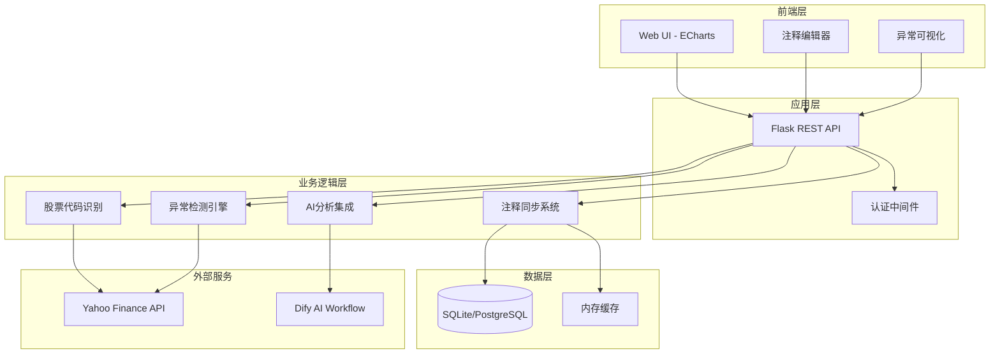
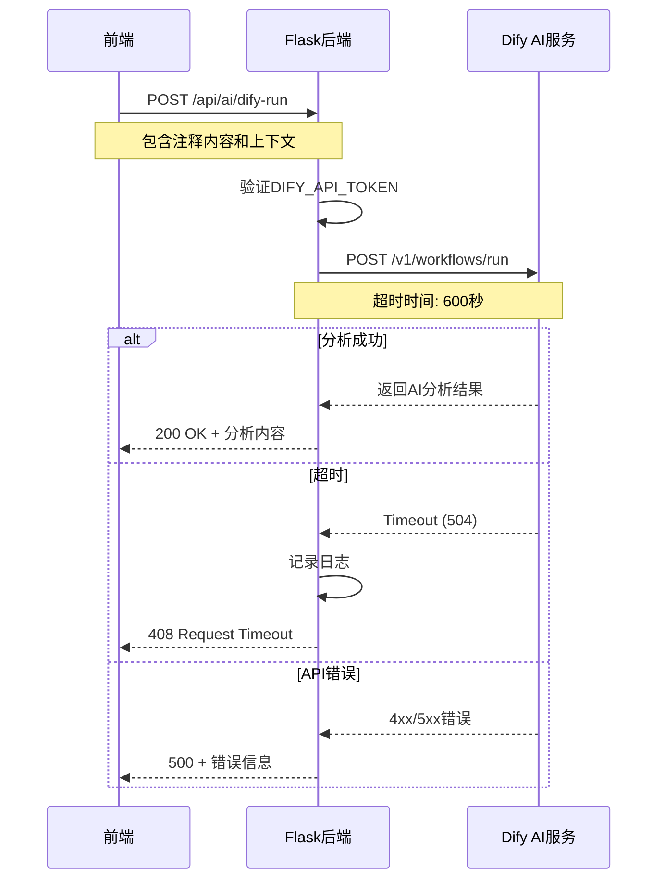
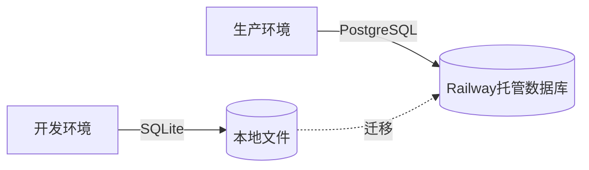

# MarketNarrative 系统架构

## 系统概览

MarketNarrative 采用分层架构设计，将职责清晰分离为前端展示、业务逻辑、数据存储三个层次。



## 核心模块详解

### 1. 股票代码识别系统

**设计目标**：统一处理A股、港股、美股等多市场的代码格式差异

**算法流程**：

```python
def normalize_ticker(user_input):
    """
    输入标准化流程：
    1. 检测已标准化格式 (如 600519.SH)
    2. 识别Yahoo直通格式 (如 BTC-USD, EURUSD=X)
    3. 纯英文识别为美股代码
    4. 纯数字智能推断交易所
    5. 文本搜索公司名称
    """
```

**智能推断规则**：

| 输入    | 识别类型  | 输出      | 推断依据                |
| ------- | --------- | --------- | ----------------------- |
| 600519  | A股上交所 | 600519.SH | 6开头，6位数字          |
| 000858  | A股深交所 | 000858.SZ | 0开头，6位数字          |
| 00700   | 港股      | 00700.HK  | 5位数字                 |
| TSLA    | 美股      | TSLA      | 纯英文字母              |
| 茅台    | 公司名称  | 600519.SH | 反向查找公司名称映射表  |
| BTC-USD | Yahoo直通 | BTC-USD   | 含连字符，直接传递给API |

### 2. 异常检测引擎

**核心创新**：动态阈值 + 多维度异常检测

#### 2.1 价量齐升检测 (Price-Volume Surge)

```python
def detect_price_volume_surge(data, window=20):
    """
    检测逻辑：
    1. 计算20日价格/成交量滚动均值和标准差
    2. 定义阈值：mean + 2 * std_dev
    3. 同时满足：
       - 涨幅 > 价格阈值
       - 成交量 > 成交量阈值
    """
    price_threshold = price_mean + 2 * price_std
    volume_threshold = volume_mean + 2 * volume_std
    
    return (price_change > price_threshold) & (volume > volume_threshold)
```

**为什么使用2倍标准差？**
- 统计学中2σ覆盖95%的正常数据
- 超出2σ的事件有统计显著性
- 不同股票波动率差异大，固定阈值会失效

#### 2.2 放量滞涨检测 (Volume Surge Without Price)

**业务含义**：大量资金涌入但股价不涨，可能是：
- 高位出货（主力派发）
- 重大分歧（多空博弈激烈）
- 底部换手（新资金接盘）

```python
def detect_volume_surge_no_price(data, window=20):
    """
    检测条件：
    1. 成交量 > mean + 2*std
    2. 涨幅 < mean (价格表现平淡)
    """
```

#### 2.3 缩量上涨检测 (Price Surge Without Volume)

**业务含义**：股价上涨但成交量萎缩，可能是：
- 筹码高度锁定（持有者惜售）
- 趋势延续阶段（无需放量确认）
- 控盘拉升（少量资金即可推动）

#### 2.4 暴跌检测 (Price Crash Detection)

**触发条件**：单日跌幅 < -9%

**设计考量**：
- 跌停板是-10%，-9%已接近极端情况
- 无需动态阈值，暴跌本身就是绝对事件
- 需要研究者重点关注基本面变化

### 3. 注释同步系统

**核心挑战**：日K/周K/月K的时间粒度不同，如何保持注释一致性？

#### 3.1 日K → 周K映射

```javascript
function mapDailyToWeekly(dailyAnnotation) {
    // 策略：找到包含该日期的周K
    const weekStart = getWeekStart(dailyAnnotation.start_date);
    const weekEnd = getWeekEnd(dailyAnnotation.end_date);
    
    return {
        period: 'weekly',
        start_date: weekStart,
        end_date: weekEnd,
        content: dailyAnnotation.content  // 内容保持不变
    };
}
```

#### 3.2 跨周期显示逻辑

| 当前周期 | 显示的注释来源            | 原因                   |
| -------- | ------------------------- | ---------------------- |
| 日K      | 仅日K注释                 | 避免信息过载           |
| 周K      | 周K注释 + 映射后的日K注释 | 查看详细事件时间线     |
| 月K      | 月K注释 + 映射后的周K/日K | 宏观视角，保留关键细节 |

### 4. AI分析集成

**架构设计**：后端代理模式



**为什么使用后端代理而非前端直连？**
1. **安全性**：API密钥不暴露给前端
2. **日志记录**：统一在后端记录AI调用情况
3. **重试逻辑**：后端可实现智能重试
4. **CORS问题**：避免跨域请求限制

## 数据库设计

### annotations表结构

```sql
CREATE TABLE annotations (
    id INTEGER PRIMARY KEY AUTOINCREMENT,
    ticker TEXT NOT NULL,                -- 股票代码
    period TEXT NOT NULL,                -- 周期: daily/weekly/monthly
    start_date TEXT NOT NULL,            -- 开始日期
    end_date TEXT NOT NULL,              -- 结束日期
    content TEXT NOT NULL,               -- 注释内容
    ai_analysis TEXT,                    -- AI分析结果
    original_text TEXT,                  -- 原始文本（分离存储）
    created_at TEXT NOT NULL,            -- 创建时间
    updated_at TEXT NOT NULL,            -- 更新时间
    is_favorite INTEGER DEFAULT 0        -- 是否收藏
);

-- 性能优化索引
CREATE INDEX idx_ticker_period ON annotations(ticker, period);
CREATE INDEX idx_start_date ON annotations(start_date);
```

**设计权衡**：

| 设计选择            | 原因                                       |
| ------------------- | ------------------------------------------ |
| TEXT存储日期        | SQLite无原生DATE类型，TEXT便于跨平台       |
| 分离ai_analysis字段 | 避免混淆用户原创内容和AI生成内容           |
| ticker冗余存储      | 避免JOIN查询，提升查询性能                 |
| 无外键约束          | SQLite外键性能差，业务逻辑层保证数据一致性 |

## 部署架构

### 双数据库策略



**环境检测逻辑**：

```python
IS_PRODUCTION = os.environ.get('RAILWAY_ENVIRONMENT') is not None

def get_db():
    if IS_PRODUCTION:
        # 使用PostgreSQL
        return psycopg2.connect(os.environ['DATABASE_URL'])
    else:
        # 使用SQLite
        return sqlite3.connect('annotations.db')
```

### Railway部署优化

**关键配置**：

```toml
[build]
builder = "NIXPACKS"

[deploy]
startCommand = "gunicorn app:app --workers 2 --threads 4 --timeout 120"
healthcheckPath = "/"
restartPolicyType = "ON_FAILURE"
```

**性能优化**：
- **Workers数量**：2个（Railway免费层CPU限制）
- **Threads/Worker**：4个（处理并发请求）
- **Timeout**：120秒（AI分析可能耗时较长）

## 安全设计

### 1. 认证系统

**混合认证策略**：Web Session + Basic Auth

```python
def require_api_auth(f):
    # 方式1: Web Session（浏览器用户）
    if 'logged_in' in session:
        return f(*args, **kwargs)
    
    # 方式2: Basic Auth（API调用）
    if auth.username == 'api' and auth.password == APP_PASSWORD:
        return f(*args, **kwargs)
    
    return 401 Unauthorized
```

### 2. 环境变量管理

**必需变量**：
- `SECRET_KEY`：Flask会话加密
- `APP_PASSWORD`：生产环境认证

**可选变量**：
- `DATABASE_URL`：生产环境数据库
- `DIFY_API_TOKEN`：AI功能（可不配置）

### 3. 敏感信息保护

**Git过滤**：
```gitignore
.env
*.db
*_token.txt
cookies.txt
```

## 扩展性设计

### 1. 支持新异常检测算法

```python
# 添加新检测器的接口
class AnomalyDetector:
    def detect(self, data, window=20):
        raise NotImplementedError
    
    def get_marker_style(self):
        return {'symbol': 'circle', 'color': 'red'}

# 注册新检测器
DETECTORS = [
    PriceVolumeSurgeDetector(),
    VolumeSurgeNoPriceDetector(),
    # 新增检测器在此添加
]
```

### 2. 支持新数据源

当前仅Yahoo Finance，未来可扩展：

```python
class DataSource:
    def fetch_ohlcv(self, ticker, start, end):
        raise NotImplementedError

class YahooFinanceSource(DataSource):
    # 当前实现

class AlphaVantageSource(DataSource):
    # 未来扩展
```

### 3. 多语言支持

前端已预留i18n hooks：

```javascript
// 未来可替换为动态翻译
const translations = {
    'zh-CN': { 'Price Surge': '价量齐升' },
    'en-US': { 'Price Surge': 'Price-Volume Surge' }
};
```

## 性能监控

### 关键指标

1. **API响应时间**：目标 < 500ms（不含AI分析）
2. **异常检测延迟**：< 100ms（20日窗口）
3. **数据库查询**：< 50ms（索引优化）
4. **AI分析时长**：30-120秒（外部依赖）

### 日志策略

```python
# 结构化日志
logging.info(f"Dify分析成功 annotation_id={id} duration={duration:.2f}s")
logging.error(f"Dify分析失败 error={error}")
```

**日志文件位置**：`logs/ai_analysis.log`

## 总结

MarketNarrative的架构设计遵循以下原则：

1. **简单优先**：使用SQLite而非复杂的ORM
2. **渐进增强**：核心功能无AI也可用
3. **明确职责**：前端负责交互，后端负责业务逻辑
4. **可观测性**：完善的日志和错误处理
5. **环境分离**：开发/生产环境清晰隔离

这些设计使系统在保持简洁的同时具备良好的扩展性。
